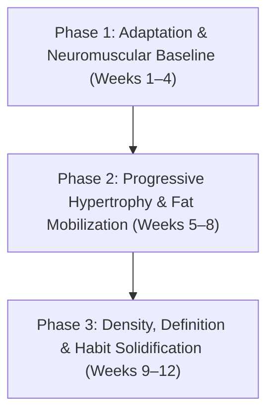

# Chapter 1: Welcome & The Blueprint Roadmap 🚀

> **"You do not rise to the level of your goals. You fall to the level of your systems."** — James Clear

Welcome to the **Body Recomposition Blueprint**. If you are reading this, you are stepping away from the chaotic cycle of conflicting fitness advice, extreme fad diets, and generic bodybuilding routines designed for athletes with pharmacological assistance.

This handbook is built upon human physiology, thermodynamics, and real-world execution.

---

## 🧭 Your Starting Point: 184 cm & 85 kg

At **184 cm (6'0.5") and 85 kg (187 lbs)**, you are at a pivotal baseline. 
* Your Body Mass Index (BMI) sits around **25.1**, which is right at the boundary between normal weight and slightly overweight.
* More importantly, because you are **just starting out with structured resistance training**, you hold the ultimate competitive advantage in fitness: **Untrained Muscle Plasticity**.

### The "Novice Effect" Unlocked
When a trained athlete wants to build 1 kg of muscle, it can take 6 to 12 months of grueling training in a caloric surplus. But as an untrained beginner:
1. Your muscle receptors (androgen and mechanosensors) have **never experienced high mechanical tension**.
2. When exposed to progressive resistance training, your rate of **Muscle Protein Synthesis (MPS)** spikes higher and remains elevated significantly longer (up to 48–72 hours) than an elite lifter.
3. Your body can readily draw from your adipose fat reserves to fuel this muscle building process.

You do **not** need to do a dirty bulk (which would just make you fatter) and you do **not** need an extreme crash cut (which would cause fatigue and loss of strength). **Recomposition is your optimal path.**

---

## 🗺️ The 12-Week Recomposition Roadmap

### Phase 1: Neuromuscular Adaptation (Weeks 1 – 4)
* **Training Focus:** Mastering movement patterns (squat, hinge, press, pull). Building mind-muscle connection and tendon resilience.
* **Nutrition Focus:** Establishing the 180g protein habit without failure. Calibrating hydration and calorie tracking.
* **Expected Outcome:** Rapid strength jumps (neural efficiency), slight water weight fluctuations as creatine and glycogen saturate muscle bellies, zero fat gain.

### Phase 2: Hypertrophy & Fat Mobilization (Weeks 5 – 8)
* **Training Focus:** Applying strict double progression (+2.5 kg or +1 rep per set). Maintaining 1–2 Reps in Reserve (RIR).
* **Nutrition Focus:** Seamless execution of calorie cycling (2,250 kcal on training days / 1,950 kcal on rest days).
* **Expected Outcome:** Visible reduction in waist circumference, shoulder and chest width noticeably broadening, sleeves fitting tighter.

### Phase 3: Muscle Density & Consolidation (Weeks 9 – 12)
* **Training Focus:** Peak working set intensity with pristine form. Solidifying the 4-day gym rhythm as an automated lifestyle habit.
* **Nutrition Focus:** Intuitive macro portioning; effortless navigation of office and social meals.
* **Expected Outcome:** Measurable drop in body fat percentage, noticeable abdominal definition, structural posture improvements, sustained high energy.

---

## 🧠 The 3 Recomposition Mindset Principles

1. **The Gym Logbook is Truth:**
   If your scale weight stays at 85 kg over 8 weeks, but your dumbbell bench press increases from 16 kg to 26 kg and your squat increases from 40 kg to 80 kg, **you have gained pure contractile muscle and burned significant body fat.** Trust the performance data.

2. **Protein is an Appointment, Not an Afterthought:**
   Hitting 180g of protein every day requires strategy. You cannot wake up at 6 PM having eaten only 30g of protein and expect to easily hit 180g before bed. Space it out across 4 structured meals.

3. **Consistency Beats Intensity:**
   Four focused 50-minute sessions executed every single week for 12 weeks will transform your body far more than sporadic two-hour marathon sessions that lead to burnout and missed workouts.

---

> [!NOTE]
> Proceed to [Chapter 2: The Science of Body Recomposition](chapter02-science.md) to understand the cellular mechanisms that make simultaneous muscle growth and fat loss possible.
