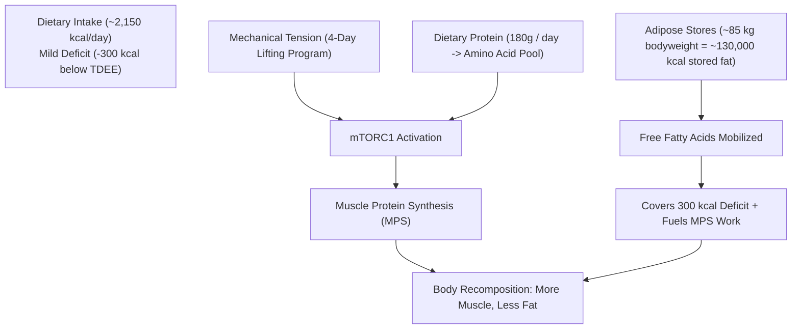
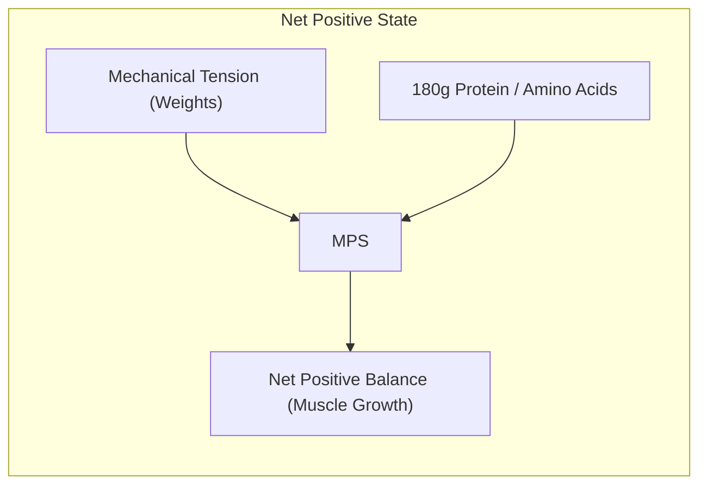

# Chapter 2: The Science of Body Recomposition 🔬

> **"Can you actually build muscle and lose fat at the same time?"**
> **The answer from peer-reviewed exercise physiology is an unequivocal yes.**

For decades, fitness magazines preached that gaining muscle requires an aggressive calorie surplus ("bulking") while losing fat requires an aggressive calorie deficit ("cutting"). This dogma was largely imported from enhanced competitive bodybuilders using anabolic agents.

For natural lifters—especially novices—this binary model is obsolete. Let us look at the cellular biology.

---

## ⚡ The Energy Flux Equation: How the Body Fuels Muscle Growth

Muscle tissue and adipose (fat) tissue are two separate physiological compartments regulated by different hormonal pathways and energy systems.

1. **Muscle Protein Synthesis (MPS):** The process of turning dietary amino acids into contractile myofibrillar proteins (actin and myosin).
2. **Lipolysis:** The breakdown of stored triglycerides in adipose tissue into free fatty acids and glycerol for cellular energy.

To synthesize 1 kilogram of new muscle tissue requires roughly **5,000 to 7,500 kilocalories of metabolic work** (fueling peptide bond synthesis, ribosome transcription, and cellular repair). 

Where does this energy come from when you are in a mild calorie deficit?

Because your body at 85 kg carries tens of thousands of calories in stored fat, **your adipose tissue acts as a battery pack**, supplying the requisite chemical energy to synthesize new muscle tissue while dietary calories remain at a modest deficit.

---

## 🧬 Net Protein Balance: MPS vs. MPB

At any given second of the day, your muscles are in a dynamic state between two opposing forces:

$$\text{Net Protein Balance (NPB)} = \text{Muscle Protein Synthesis (MPS)} - \text{Muscle Protein Breakdown (MPB)}$$

* If **MPS > MPB**, you gain muscle tissue (Hypertrophy).
* If **MPS < MPB**, you lose muscle tissue (Atrophy).

### What Dictates This Balance?
1. **Mechanical Tension (The Stimulus):** Lifting weights within 1–3 reps of failure stretches and activates mechanosensors, turning on the **mTORC1** pathway.
2. **Amino Acid Availability (The Bricks):** High blood concentrations of essential amino acids (EAAs)—specifically the branched-chain amino acid **Leucine**—are required to sustain MPS.
3. **Recovery Window (The Assembly Time):** MPS remains elevated for 24 to 48 hours post-workout. If adequate protein is available throughout this window, muscle hypertrophy proceeds unabated.

---

## 🧪 The Leucine Trigger & The "All-or-None" Law

Dietary protein is not absorbed continuously like water through a sponge; Muscle Protein Synthesis operates on a **switch mechanism**:

* **Below the Leucine Threshold (~2.0g leucine per meal):** MPS is minimally stimulated.
* **At the Leucine Threshold (~2.7g – 3.2g leucine per meal):** MPS is maximally stimulated (turned fully ON).
* **Beyond the Threshold:** Extra leucine in that meal does not increase MPS further; excess amino acids are oxidized for energy.

For an 85 kg individual, reaching this threshold requires approximately **35g to 45g of high-quality complete protein per meal** (e.g., 150g chicken breast, 4 whole eggs + 2 egg whites, or 1 scoop of whey isolate + milk).

Eating **40g–45g protein across 4 meals spaced 3.5–5 hours apart** spikes MPS multiple times per day, keeping your Net Protein Balance positive 24/7.

---

## ⚠️ Why Severe Deficits Destroy Recomposition

Some people mistakenly assume: *"If a 300 kcal deficit works, a 1,000 kcal deficit will be three times faster!"*

In exercise physiology, this is catastrophic for three reasons:
1. **AMPK Activation Overwhelms mTOR:** Extreme energy deficits activate AMPK (the cellular energy sensor), which directly shuts down the mTOR pathway, halting muscle growth.
2. **Hormonal Downregulation:** Severe calorie restriction drops thyroid hormone (T3), downregulates luteinizing hormone (lowering testosterone), and spikes systemic cortisol.
3. **Elevated Muscle Protein Breakdown (MPB):** In an aggressive starvation state, the body will deaminate muscle proteins to convert them into glucose (gluconeogenesis).

**The Recomposition Rule:** Keep the deficit modest (**10% to 15% maximum**, ~250–350 kcal below maintenance). This preserves training energy and hormones while burning fat.

---

> [!TIP]
> Read the primary literature supporting these principles in the [Scientific References](references.md) section. Next, calculate your exact TDEE and daily numbers in [Chapter 3: Caloric Balance & TDEE](chapter03-nutrition.md).
