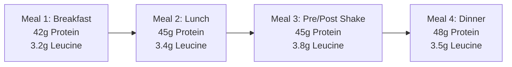
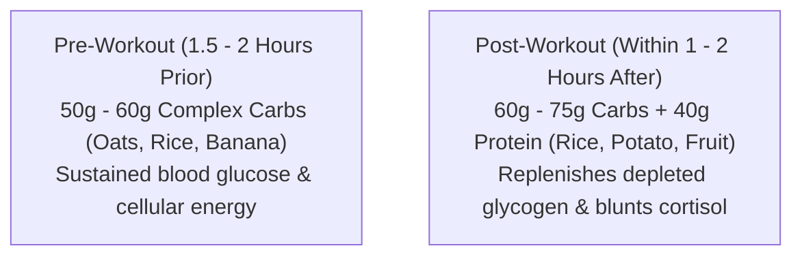

# Chapter 4: The 180g Macro Protocol 🥩

> **"Protein builds the structure. Carbohydrates power the performance. Fats orchestrate the endocrine system."**

For an athlete weighing **85 kg** striving for simultaneous fat loss and hypertrophy, macronutrient composition is what separates pure fat loss from muscle wasting.

---

## 🥩 Pillar 1: Protein (The Structural Foundation)

### The Target: 180 Grams / Day (~2.1 g/kg bodyweight)
In a calorie deficit, the body’s oxidation of amino acids increases. Consuming **180g of protein daily** achieves three critical objectives:
1. **Suppresses Muscle Breakdown (Anti-Catabolic):** Protects existing muscle tissue from being deaminated into glucose.
2. **Fuels Muscle Protein Synthesis (MPS):** Provides the building blocks (essential amino acids) to form new myofibrillar proteins.
3. **High Thermic Effect of Food (TEF):** Protein has a 20–30% thermic burn. Eating 180g of protein (720 kcal) burns ~180 kcal just in the act of digestion!

### The 4-Feeding Distribution (The Leucine Pulse)
Rather than consuming 100g of protein in one meal and 20g in another, spread your intake evenly:

Each meal crosses the **3.0g Leucine threshold**, triggering the mTORC1 pathway 4 distinct times in a 24-hour cycle.

---

## 🥑 Pillar 2: Fats (Hormonal Health & Endocrine Floor)

### The Target: 65g – 70g / Day (~0.75 – 0.8 g/kg)
Many people on a diet make the mistake of cutting dietary fats to near-zero to slash calories. For natural male lifters, this is devastating:
* **Testosterone Production:** Cholesterol is the direct precursor molecule for testosterone synthesis inside Leydig cells.
* **Cell Membrane Fluidity:** Healthy fats ensure proper insulin receptor sensitivity.
* **Fat-Soluble Vitamins:** Absorption of Vitamins A, D, E, and K requires dietary lipids.

### Best Sources for Your Omnivore Plan
* Whole eggs (yolks are packed with choline and bioavailable cholesterol).
* Extra virgin olive oil (monounsaturated oleic acid).
* Raw almonds, walnuts, and pumpkin seeds.
* Fatty fish (salmon, sardines) or omega-3 supplementation.
* Avocados.

---

## 🍚 Pillar 3: Carbohydrates (Performance Fuel)

### The Target: 200g – 220g (Training Days) / 150g – 160g (Rest Days)
Carbohydrates are not your enemy. In fact, training without adequate muscle glycogen reduces your ability to generate maximum force, which blunts the hypertrophic signal.

### Peri-Workout Nutrient Timing
Focus 60% of your daily carbohydrate intake around your training window:

* **Complex Carbs:** Rolled oats, jasmine/basmati rice, sweet potatoes, whole wheat flatbreads/roti, quinoa.
* **Fiber Goal:** Maintain **30g to 35g of dietary fiber daily** from vegetables and whole grains for gut microbiome diversity and hunger suppression.
