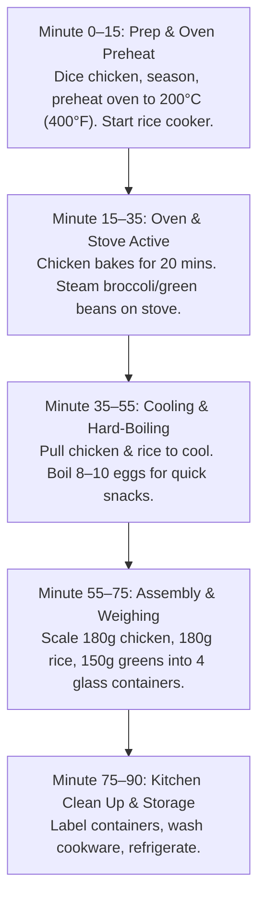

# Chapter 8: The 90-Minute Weekly Meal Prep ⏱️

> **"You do not need to spend your entire weekend in the kitchen. 90 minutes of parallel cooking on Sunday afternoon guarantees your nutrition for the entire work week."**

Consistency dies when hunger strikes and you have nothing healthy ready to eat. The 90-minute prep system solves this forever.

---

## 🛠️ Required Equipment

* **1 Digital Kitchen Food Scale:** Non-negotiable for accurate portioning.
* **5 Glass Airtight Meal Containers (BPA-Free):** Glass keeps food fresher than plastic and reheats without chemical leaching.
* **1 Large Baking Sheet or Air Fryer:** For cooking batch protein simultaneously.
* **1 Rice Cooker or Large Pot:** For complex carbohydrate batching.

---

## 🔄 The 90-Minute Parallel Workflow

---

## 🍗 Step-by-Step Batch Instructions

### 1. Batch Cook 1.2 kg Chicken Breast
* Trim fat, butterfly chicken breasts into even cutlets so they cook uniformly.
* Season with olive oil, lemon juice, garlic powder, paprika, salt, and black pepper.
* Bake at 200°C (400°F) for 18–20 minutes, or air-fry in batches at 190°C for 12–14 minutes.
* **Critical Rule:** Let the chicken rest for 10 minutes on a cutting board before slicing. This locks in internal juices so it doesn't dry out when reheated at work.

### 2. Batch Cook Jasmine or Basmati Rice
* Rinse 350g of raw rice until water runs clear (removes excess surface starch).
* Cook with 1:1.5 ratio of water to rice with 1 tsp salt. Yields approximately 900g–1,000g of fluffy cooked rice.

### 3. Steam 600g Vegetables
* Chop broccoli crowns or trim green beans.
* Steam over boiling water for just 4–5 minutes until vibrant green and slightly crisp. (Overcooking causes vegetables to get soggy during storage).

### 4. Portioning & Assembly
Place each glass container on your food scale, tare to 0g, and fill:
* **Container 1–4 (Mon–Thu Lunches):**
  * 180g cooked chicken breast (approx. 45g protein)
  * 180g cooked rice (approx. 50g carbs)
  * 120g–150g steamed vegetables
  * Add 1 tbsp of hot sauce or mustard for flavor.

---

## 🧊 Storage & Reheating Guidelines

* **Monday – Wednesday Meals:** Store directly in the main refrigerator compartment (0–4°C).
* **Thursday – Friday Meals:** Place in the freezer on Sunday night. Move to the fridge on Wednesday evening to thaw naturally.
* **The Microwave Reheat Hack:** When reheating chicken at the office, place a damp paper towel over the glass container and microwave at **70% power for 2 minutes**. This steams the chicken, keeping it tender and juicy instead of rubbery.
