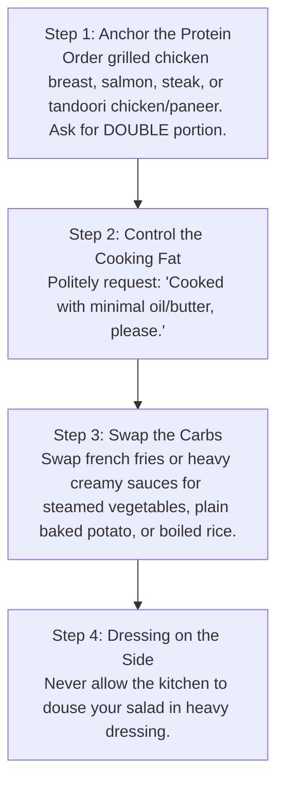

# Chapter 9: Office Nutrition & Desk-Job Tactics 💼

> **"The corporate office is designed to make you sedentary, over-caffeinated, and constantly grazing on hyper-palatable snacks. You need a defense strategy."**

Working a full-time desk job while recomposing your physique requires tactical awareness. A single catered lunch or mindless break-room snacking can easily blow your 300 kcal deficit.

---

## 🛡️ The Desk-Drawer Survival Kit

Keep these staples in your office desk or locker so you never find yourself ravenous at 4:00 PM with only vending machine junk as an option:

1. **Whey Protein Powder (in a shaker bottle):** Keep a dry scoop ready. Just add cold water from the office cooler for an instant 25g–30g protein shot.
2. **Individual Packs of Raw Almonds (30g portions):** Prevents mindless handfuls from large bags.
3. **High-Quality Green Tea or Black Coffee:** Natural appetite suppressant and antioxidant source for morning focus.
4. **1-Litre Insulated Stainless Steel Water Bottle:** Keep on your desk; finish 2 full bottles before leaving the office (2 Litres guaranteed).

---

## 🍽️ The Restaurant & Business Lunch Protocol

When dining out with colleagues or clients, follow the **"Anchor & Swap" Rule**:

### Restaurant Green Flags vs. Red Flags
* ✅ **Green Flags:** Grilled, baked, tandoori, poached, steamed, blackened.
* ❌ **Red Flags:** Crispy, breaded, tempura, creamy, glazed, pan-fried, au gratin.

---

## ☕ Caffeine Strategy for Working Professionals

Caffeine is a potent metabolic booster and workout enhancer, but improper timing ruins sleep—which crushes muscle recovery:

* **Morning Delay:** Wait **60 to 90 minutes after waking** before having your first cup of coffee. This allows your natural cortisol spike to wake you up and clears residual adenosine, preventing the dreaded 2:00 PM energy crash.
* **The 2:00 PM Hard Cutoff:** Caffeine has an average half-life of 5 to 7 hours and a quarter-life of up to 12 hours. A coffee consumed at 4:00 PM still has 25% of its caffeine stimulating your brain at 4:00 AM, destroying restorative Stage 3 Slow-Wave Sleep and Growth Hormone release.

---

## 🚶‍♂️ Hitting 8,000–10,000 Steps at a Desk Job

You cannot sit immobile for 9 hours and expect a 45-minute gym session to compensate for complete daily stagnation. Integrate NEAT (Non-Exercise Activity Thermogenesis) seamlessly:

1. **The 5-Minute Hourly Reset:** Set a recurring silent phone timer. Stand up every 60 minutes, stretch your hip flexors, and walk for 250 steps.
2. **Walk-and-Talk Phone Calls:** Take all 1-on-1 audio meetings or phone calls while pacing in a hallway or outside around the office perimeter.
3. **Park at the Perimeter:** Park at the far edge of the lot, or get off the transit/metro one stop early (adds 1,200–1,500 effortless steps daily).
4. **Post-Lunch 10-Minute Walk:** A 10-minute stroll immediately following lunch blunts post-prandial blood glucose spikes by 30% and keeps afternoon brain fog at bay.
