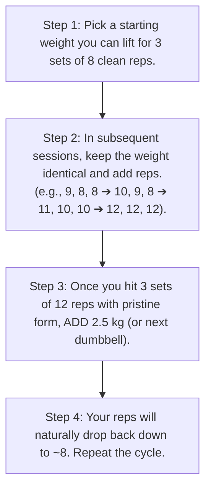

# Chapter 10: The 4-Day Upper/Lower Split 🏋️‍♂️

> **"Stimulate, do not annihilate. Muscle growth is triggered by progressive mechanical tension, not extreme soreness."**

As an untrained lifter with access to a fully equipped commercial gym, the **4-Day Upper/Lower Split** is the gold standard. It provides the ideal balance of training frequency (hitting every muscle group twice per week) and recovery time for your central nervous system.

---

## ⚙️ The Mechanics of Progression: Double Progression Model

To build muscle during a recomposition, your body needs a reason to adapt. That reason is **Progressive Overload**.

We use the **Double Progression System** across a prescribed rep bracket (e.g., 8–12 reps):

### Proximity to Failure: 1–2 RIR (Reps in Reserve)
* **What is RIR?** Reps in Reserve means how many more reps you could have completed before mechanical failure.
* **The Sweet Spot:** Stop every working set with **1 to 2 clean reps left in the tank**. 
* **Why Not Train to Failure?** Training to absolute failure on compound lifts spikes systemic fatigue, dramatically extends recovery time, and increases injury risk without delivering superior hypertrophy.

---

## 📅 The 4-Day Training Routine

### 🔴 Workout 1: Upper Body A (Horizontal Bias) — Monday
*Focus: Chest, Upper Back Thickness, Triceps*

| Exercise | Equipment | Sets | Rep Target | Rest Period | Notes |
| :--- | :--- | :--- | :--- | :--- | :--- |
| **1. Flat Dumbbell Bench Press** | Dumbbells & Bench | 3 | 8 – 10 reps | 2 mins | Deep chest stretch at bottom; explosive press |
| **2. Chest-Supported T-Bar / DB Row** | Machine or DBs | 3 | 8 – 10 reps | 2 mins | Drive elbows back; squeeze scapulae |
| **3. Incline Dumbbell Press (30°)** | Dumbbells & Bench | 3 | 10 – 12 reps | 90 secs | Clavicular upper chest focus |
| **4. Neutral-Grip Cable Lat Pulldown** | Cable Pulldown | 3 | 10 – 12 reps | 90 secs | Pull to upper chest; control 2-sec eccentric |
| **5. Cable Lateral Raises** | Cable Tower | 3 | 12 – 15 reps | 60 secs | Medial delt width; lead with elbows |
| **6. Tricep Rope Pushdowns** | Cable Tower | 3 | 12 – 15 reps | 60 secs | Flare rope outwards at bottom lock |

---

### 🔵 Workout 2: Lower Body A (Quad Bias) — Tuesday
*Focus: Quadriceps, Hamstring Safety, Calves, Core*

| Exercise | Equipment | Sets | Rep Target | Rest Period | Notes |
| :--- | :--- | :--- | :--- | :--- | :--- |
| **1. Barbell Back Squat (or Hack Squat)** | Squat Rack / Machine | 3 | 6 – 8 reps | 2.5 mins | Break at hips and knees; reach parallel depth |
| **2. Romanian Deadlift (RDL)** | Dumbbells or Barbell | 3 | 8 – 10 reps | 2 mins | Hip hinge focus; stretch hamstrings without rounding back |
| **3. Leg Press (Feet shoulder-width)** | Leg Press Machine | 3 | 10 – 12 reps | 90 secs | Controlled descent; do not lock knees at lockout |
| **4. Lying or Seated Leg Curls** | Machine | 3 | 10 – 12 reps | 90 secs | Isolate knee flexion; 2-sec slow lowering |
| **5. Standing Calf Raises** | Smith Machine / Calf Block | 3 | 12 – 15 reps | 60 secs | 2-sec pause at deep stretch; full extension |
| **6. Hanging Knee / Leg Raises** | Pull-Up Bar / Captain's Chair | 3 | 12 – 15 reps | 60 secs | Posterior pelvic tilt; tuck pelvis toward chin |

---

### 🔴 Workout 3: Upper Body B (Vertical Bias & Shoulders) — Thursday
*Focus: Shoulders, Upper Back Width, Biceps*

| Exercise | Equipment | Sets | Rep Target | Rest Period | Notes |
| :--- | :--- | :--- | :--- | :--- | :--- |
| **1. Standing Overhead Barbell / DB Press** | Barbell or DBs | 3 | 6 – 8 reps | 2 mins | Core braced tight, glutes clenched; full lockout |
| **2. Wide-Grip Lat Pulldown** | Cable Tower | 3 | 8 – 10 reps | 2 mins | Drive elbows down toward back pockets |
| **3. Flat Barbell or Machine Chest Press** | Barbell / Machine | 3 | 10 – 12 reps | 90 secs | Consistent bar path across lower sternum |
| **4. Seated Cable Row (Wide or Close Grip)**| Cable Machine | 3 | 10 – 12 reps | 90 secs | Protracted stretch, retracted squeeze |
| **5. Dumbbell Incline Lateral Raises** | DBs & 60° Bench | 3 | 12 – 15 reps | 60 secs | Eliminates momentum for pure side delt tension |
| **6. Incline Dumbbell Bicep Curls** | DBs & 45° Bench | 3 | 10 – 12 reps | 60 secs | Long head bicep stretch behind the torso |

---

### 🔵 Workout 4: Lower Body B (Posterior Chain Bias) — Friday
*Focus: Glutes, Hamstrings, Quad Hypertrophy, Core*

| Exercise | Equipment | Sets | Rep Target | Rest Period | Notes |
| :--- | :--- | :--- | :--- | :--- | :--- |
| **1. Barbell / Trap Bar Deadlift** | Barbell / Trap Bar | 3 | 5 – 6 reps | 3 mins | Pure strength foundation; reset each rep |
| **2. Bulgarian Split Squats** | Dumbbells | 3 | 8 – 10 reps/leg | 90 secs | Single-leg balance & quad/glute development |
| **3. Seated Leg Extensions** | Machine | 3 | 12 – 15 reps | 60 secs | Pure rectus femoris isolation; pause at top |
| **4. Seated Hamstring Curls** | Machine | 3 | 10 – 12 reps | 60 secs | Hamstring knee flexion at lengthened position |
| **5. Seated Calf Raises** | Machine | 3 | 12 – 15 reps | 60 secs | Soleus muscle hypertrophy |
| **6. Cable Woodchoppers or Ab Wheel** | Cable / Wheel | 3 | 12 reps/side | 60 secs | Rotational strength & anti-extension core stability |

---

## ⏱️ Warm-Up Protocol (5 Minutes Before Each Session)

Never jump directly into your working weights:
1. **General Warm-up (2 mins):** 2 minutes on the rowing machine or incline treadmill to raise core body temperature.
2. **Dynamic Mobility (2 mins):** Arm circles, band pull-aparts, hip openers, bodyweight deep squats.
3. **Specific Warm-up Sets:**
   * Set 1: Empty bar or 40% working weight x 10 reps (fast tempo)
   * Set 2: 60% working weight x 5 reps
   * Set 3: 80% working weight x 2 reps
   * *Rest 2 minutes, then begin Working Set 1.*
