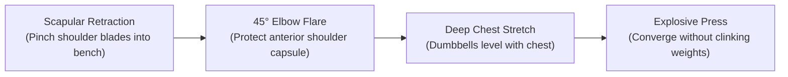

# Chapter 11: Exercise Library & Movement Cues 📖

> **"Form dictates tension; tension dictates growth. Flailing with heavy weights only builds ego and joint wear."**

As a novice lifter, mastering the technical execution of these foundational compound movements will pay dividends for the rest of your lifting life. Below are the execution cues and common pitfalls for your core exercises.

---

## 🏋️‍♂️ 1. Flat Dumbbell Bench Press (Chest & Triceps)

* **Setup:** Sit on the bench with dumbbells resting vertically on your thighs. Kick knees up one at a time as you lie back.
* **The Retraction Cue:** Imagine pinching a pencil between your shoulder blades and shoving them down into your back pockets. Keep this arch locked throughout.
* **Elbow Path:** Do not flare elbows out at 90° (impingement hazard). Keep elbows tucked at approximately **45° to 60°** relative to your torso.
* **Common Mistake:** Bouncing dumbbells off each other at the top. This removes tension from the pectorals. Stop 2 inches short of touching.

---

## 🦵 2. Barbell Back Squat & Goblet Squat (Quads & Glutes)

* **The Foot Stance:** Feet slightly wider than shoulder-width, toes turned out 15°–30°. Create a **"Tripod Foot"** (pressure distributed evenly across the big toe, pinky toe, and heel).
* **The "Valsalva" Core Brace:** Take a deep diaphragmatic breath into your belly (not chest), brace your abs as if expecting a punch in the stomach, and hold until you pass the sticking point on the ascent.
* **Movement Cue:** *"Sit down between your hips, not back like onto a chair."* Drive knees out in line with your toes.
* **Depth Standard:** Crease of the hip should reach or break parallel with the top of the patella (kneecap).
* **Common Mistake:** Letting knees cave inward (*valgus collapse*) or heels lifting off the floor during the drive.

---

## 🍑 3. The Romanian Deadlift / RDL (Hamstrings & Glutes)

* **Setup:** Hold dumbbells or barbell with an overhand grip at mid-thigh height. Stand with feet hip-width apart.
* **The Movement:** Maintain "soft knees" (slight 15° bend) and lock that knee angle in stone. Do not turn this into a squat!
* **The Hip Hinge Cue:** *"Push a heavy car door shut behind you with your butt."* Keep the barbell/dumbbells grazing your thighs and shins as your hips travel horizontally backward.
* **Reversal Point:** Lower until your hips stop traveling backward (usually just below the knee/mid-shin). Squeeze your glutes to drive hips forward to standing.
* **Common Mistake:** Rounding the lumbar spine to touch the floor. Your range of motion is determined by hamstring flexibility, not floor proximity.

---

## 🧗‍♂️ 4. Neutral-Grip Lat Pulldown & Wide Pulldown (Back Width)

* **Setup:** Adjust thigh pad so your knees are wedged tight with zero lift.
* **Scapular Depression Cue:** Before your elbows bend, **depress your shoulder blades downwards** by 2 inches. Then drive your elbows down toward your back pockets.
* **Torso Position:** Lean back slightly (10°–15° angle). Pull the bar down until it touches your upper chest / collarbone.
* **The Eccentric:** Control the ascent for a full 2 to 3 seconds until you feel a complete stretch in the lats.
* **Common Mistake:** Leaning back 45° and turning the pulldown into a sloppy momentum row.

---

## 🎯 5. Standing Overhead Press (Shoulders & Core)

* **Setup:** Grip the bar slightly outside shoulder width. Forearms must be vertically stacked under the bar.
* **The Foundation Cue:** Squeeze your glutes, brace your abs, and lock your quadriceps. Your body must act as an immovable pillar.
* **The Path:** Pull your chin slightly back so the bar clears your nose in a straight vertical line. Once the bar clears your forehead, push your head through the "window" and lock out overhead with active traps.
* **Common Mistake:** Hyperextending the lower back to turn the press into a standing incline bench press. Keep ribs pinned down.

---

## ⚡ 6. Cable Lateral Raise (Side Deltoid Hypertrophy)

* **Setup:** Set the cable pulley to wrist or hip height. Grab the single handle (or cuff attachment) across your body.
* **The Angle:** Lean slightly forward (10°–15°) into the movement.
* **The Cue:** *"Push the cable out toward the side walls, not up to the ceiling."* Imagine pouring water out of a pitcher at the top with pinkies slightly higher than thumbs.
* **Common Mistake:** Using upper traps to shrug the weight up or swinging the torso.
