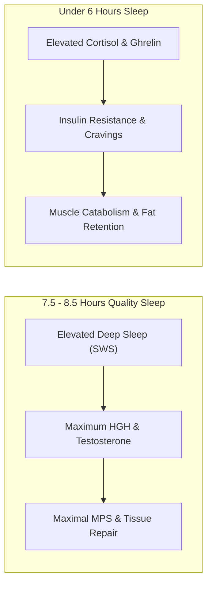

# Chapter 12: Sleep & Nervous System Recovery 🌙

> **"You do not grow in the gym. You break down muscle fibers in the gym; you rebuild them bigger and stronger while sleeping in bed."**

Training provides the stimulus; nutrition provides the building blocks; **sleep provides the physiological construction crew.** If your sleep is compromised, your body recomposition will stall—regardless of how clean your diet is.

---

## 🔬 The Hormonal Cost of Sleep Deprivation

When sleep drops below 7 hours per night:
* **Human Growth Hormone (HGH) Collapses:** Up to **70% of daily HGH pulsatile secretion** occurs during Stage 3 Slow-Wave Sleep (Deep Sleep). Depriving yourself of deep sleep directly reduces tissue repair.
* **Testosterone Levels Drop:** Sleeping 5 hours a night for one single week reduces circulating daytime testosterone by **10% to 15%** in healthy young men (equivalent to 10–15 years of biological aging).
* **Cortisol and Ghrelin Spike:** Systemic cortisol rises, stimulating Muscle Protein Breakdown (MPB). Ghrelin (the hunger hormone) surges, making cravings for high-sugar, high-fat junk almost impossible to resist.
* **Insulin Resistance:** Sleep-deprived fat cells become 30% more insulin-resistant, promoting fat storage and blunting nutrient delivery to skeletal muscle.

---

## 🛏️ The 5-Point Sleep Hygiene Protocol

### 1. The 10-Hour Morning Sunlight Anchor
Within 30–45 minutes of waking, get **10 to 15 minutes of direct natural sunlight** in your eyes (without sunglasses). 
* *Physiology:* Photons hit your retinal ganglion cells, signaling the suprachiasmatic nucleus (SCN) in your hypothalamus to suppress melatonin and set an internal 14-hour timer for nightly melatonin release.

### 2. Thermal Environment (18°C – 20°C / 65°F – 68°F)
To initiate sleep, your core body temperature must drop by approximately 1°C (2–3°F). A bedroom that is too hot is the leading cause of middle-of-the-night micro-awakenings. Keep your sleeping space cool and ventilated.

### 3. Absolute Darkness & Noise Control
Light exposure during sleep blunts melatonin production by up to 50%.
* Use blackout curtains or a comfortable, contoured eye mask.
* Turn off or tape over all LED standby lights on electronics.
* Use a white noise machine or fan if you live in an urban environment.

### 4. The 60-Minute Digital Sunset
Blue wavelength light from smartphones, tablets, and monitors mimics mid-day solar radiation, tricking your brain into halting sleep neurotransmitters.
* Turn off screens or switch to "Night Shift / Warm mode" 60 minutes before bed.
* Replace late-night phone scrolling with reading a physical book or mobility stretching.

### 5. The Hot Shower Vasodilation Hack
Taking a warm shower or bath 45 minutes before bed paradoxically cools your internal core. The heat brings blood to your extremities (hands and feet), which radiates heat outward and triggers rapid sleep onset once in bed.
