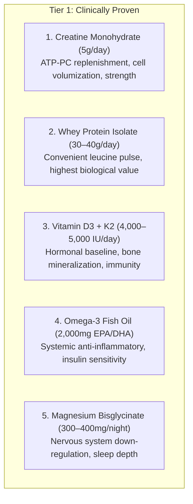

# Chapter 13: The Evidence-Based Supplement Stack 💊

> **"Supplements are the 5% optimization layer on top of a 95% foundation of nutrition, training, and sleep. Never major in the minors."**

The multi-billion-dollar fitness supplement industry thrives on marketing pseudoscience. As an 85 kg athlete focused on body recomposition, here is the objective, peer-reviewed hierarchy of what works—and what is a waste of money.

---

## 🥇 Tier 1: The Essential Core Stack

### 1. Creatine Monohydrate (5 Grams / Day)
* **What It Does:** Donates a phosphate group to regenerate ADP into ATP during high-intensity contractions (first 10 seconds of heavy lifting).
* **The Recomp Benefit:** Increases intracellular water retention inside muscle cells (cell swelling activates protein synthesis signaling). Increases 1-rep and 5-rep strength by 5–10%.
* **How to Take:** 5g daily dissolved in water or post-workout shake. **No loading phase required;** muscles will fully saturate in 21–28 days. Take every day, including rest days.
* **Myth Buster:** Creatine causes intracellular water storage *inside* the muscle cell, NOT under the skin (subcutaneous bloat). It makes your muscles look fuller, not softer.

### 2. Whey Protein Isolate
* **What It Does:** Fast-digesting, complete protein with the highest concentration of Branched-Chain Amino Acids (~11% leucine).
* **How to Take:** 1 to 1.25 scoops (30g–38g) post-workout or as a high-protein office snack.

### 3. Vitamin D3 (with Vitamin K2)
* **What It Does:** Vitamin D functions more like a steroid hormone than a vitamin. It modulates androgen receptors in skeletal muscle and supports calcium homeostasis.
* **Dosing:** 4,000 to 5,000 IU of D3 paired with 100 mcg of K2 (MK-7) with your first fatty meal of the day (e.g., breakfast eggs).

### 4. High-Potency Omega-3 Fish Oil
* **What It Does:** High-concentration EPA and DHA lower inflammatory cytokines post-workout, accelerate muscle soreness recovery, and improve cell membrane fluidity for enhanced glucose uptake.
* **Dosing:** Enough capsules to deliver **2,000mg of combined EPA + DHA daily** with meals.

### 5. Magnesium Glycinate / Bisglycinate
* **What It Does:** Magnesium acts as a natural NMDA receptor blocker and GABA agonist, calming the central nervous system after intense training.
* **Dosing:** 300mg to 400mg elemental magnesium taken **45 minutes before sleep**. (Choose the *glycinate* form; avoid *magnesium oxide*, which has low bioavailability and causes digestive distress).

---

## 🥈 Tier 2: Situational Optimizers

* **Caffeine Anhydrous (150–200mg):** Potent central nervous system stimulant for morning or early afternoon training sessions. Enhances power output and blunts perceived exertion. *(Strictly before 2:00 PM).*
* **Ashwagandha (KSM-66 Extract - 600mg):** Adaptogenic herb clinically shown to lower serum cortisol by 20–25% during periods of severe work stress. Cycle 8 weeks on, 2 weeks off.

---

## 🗑️ Tier 3: The "Do Not Buy" Blacklist

Save your money and avoid these industry gimmicks:
* ❌ **Branched-Chain Amino Acids (BCAAs):** Completely redundant if you are already consuming 180g of whole protein and whey.
* ❌ **Over-the-Counter "Testosterone Boosters" (Tribulus, Fenugreek):** Zero clinical evidence of increasing free testosterone in healthy individuals.
* ❌ **"Fat Burners" & Thermogenics:** Mostly cheap caffeine and bitter orange extract that elevate heart rate without meaningful fat oxidation.
* ❌ **Detox Teas & Cleanses:** Laxatives that dehydrate you and disrupt electrolyte balance.
