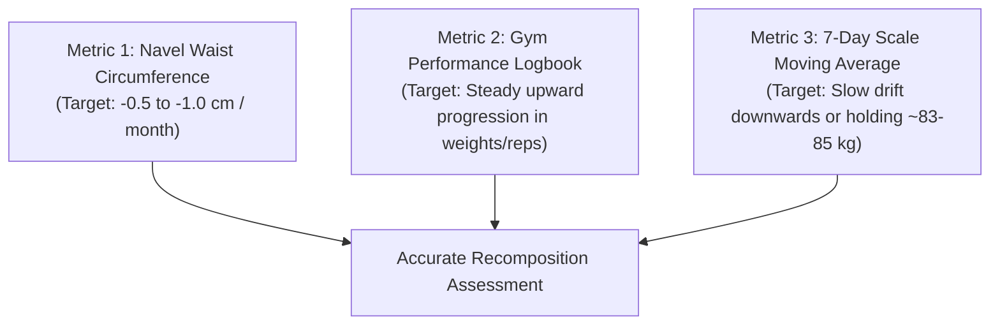

# Chapter 14: Measuring True Progress (The 3-Metric Rule) 📏

> **"If you only measure bodyweight, you will think your body recomposition is failing when it is actually succeeding."**

The biggest reason novices abandon body recomposition within 4 weeks is reliance on the bathroom scale.

Consider this mathematical reality:
* **Over 6 weeks:** You lose 2.0 kg of visceral and subcutaneous adipose tissue.
* **Over the same 6 weeks:** You gain 1.8 kg of dense muscle tissue, glycogen, and intracellular water from creatine.
* **The Scale Reads:** 85 kg $\rightarrow$ 84.8 kg (a tiny change of -0.2 kg).

To the untrained eye, it looks like "nothing happened." In reality, **your waist has shrunk by 3 cm, your chest and arms have grown, and your metabolic rate has accelerated.**

---

## 📐 The 3-Metric Recomposition Rule

---

## 🧵 1. Navel Waist Circumference (The Fat Loss Truth)

Visceral and abdominal fat around the midsection is the most biologically active adipose depot. Measuring your waist is the single most accurate low-tech indicator of true fat loss:
* **How to Measure:** Stand upright, relaxed, and breath normally (do not suck your gut in). Place a flexible fiberglass tape measure directly over your navel (belly button), parallel to the floor.
* **Frequency:** Once a week on Sunday morning, immediately after waking and using the bathroom, before eating or drinking.
* **The Benchmark:** In an effective recomp, your waist circumference should decrease steadily by **0.5 cm to 1.0 cm every 3 to 4 weeks**.

---

## 📓 2. The Gym Performance Logbook (The Hypertrophy Truth)

Muscle cannot grow without progressive mechanical tension. If your lifts are increasing across your 8–12 rep range, **you are building muscle**:
* **Track Every Session:** Use a physical notebook or notes app. Log:
  * Exercise Name
  * Weight Lifted (kg)
  * Repetitions Completed
  * RIR (Reps in Reserve)
* **The Benchmark:** Aim to add either **+1 rep** to your sets or **+2.5 kg** to the exercise every 1 to 2 weeks.

---

## ⚖️ 3. The 7-Day Scale Moving Average

Daily scale weight fluctuates by 1–2 kg due to water retention, salt intake, gut transit, and glycogen. A single weigh-in means nothing.
* **The Routine:** Weigh yourself every morning after using the bathroom, completely unclothed.
* **The Math:** Add up the 7 daily weigh-ins and divide by 7 to get your **Weekly Moving Average**.
* **Interpretation:**
  * If the weekly average is holding flat at ~84–85 kg AND your waist is shrinking: **Perfect Recomposition.**
  * If your waist is shrinking AND weight is slowly dropping 0.2–0.4 kg/week: **Lean Recomposition.**
  * If weight is dropping >1 kg/week AND your gym strength is collapsing: **Too aggressive deficit; increase calories by 150 kcal.**

---

## 📸 Standardized Progress Photos

Take photos every 4 weeks:
1. **Front, Side, and Back poses** with relaxed posture.
2. **Consistent Lighting:** Use natural indirect light in the same room.
3. **Unpumped:** Take photos on Sunday morning before working out, not right after a gym pump.
