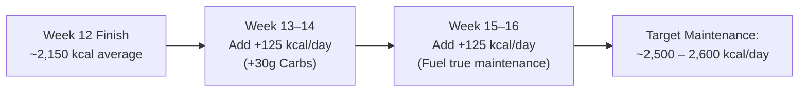

# Chapter 16: Long-Term Maintenance & Lifestyle Integration 🏖️

> **"Fitness is not an event you finish; it is a permanent operating system you install."**

Once you achieve your initial body recomposition—leaning down while packing on noticeable muscle mass—the goal shifts from aggressive adaptation to **effortless lifelong maintenance** or structured lean mass accrual.

---

## 🔄 The Reverse Diet Protocol: Returning to True Maintenance

After 12 to 16 weeks of recomposition, your metabolism will have adapted to the lower calorie intake. If you suddenly jump from 2,100 kcal back to unmonitored eating, your hyper-sensitive fat cells will rapidly absorb excess calories.

To transition smoothly without gaining unwanted fat, use a **Reverse Diet**:

By gradually increasing carbohydrates and calories by **100 to 150 kcal per day every two weeks**, your metabolic rate ramps back up, your thyroid hormone (T3) normalizes, and your gym strength explodes—with zero fat gain.

---

## 🛡️ The Minimum Effective Volume (MEV) Lifesaver

There will be weeks when life, family, or critical work deadlines make hitting the gym 4 times impossible.

Here is the scientific reality of muscle maintenance:
* **To build new muscle:** Requires 10–16 working sets per muscle group per week.
* **To maintain 100% of existing muscle:** Requires only **3 to 5 hard working sets per muscle group per week**!

If you enter a high-stress month at work, you do not need to quit. Switch to a **2-Day Full Body Maintenance Routine** (e.g., Wednesday and Saturday: Squat, Bench, Row, Overhead Press for 3 sets each). You will preserve all your hard-earned muscle until your schedule frees up.

---

## ⚖️ The 80/20 Lifestyle Rule

Permanent adherence does not mean weighing every single grain of rice for the rest of your life:

* **80% of Calories:** Clean, single-ingredient whole foods (eggs, chicken, fish, rice, oats, fruits, green vegetables, olive oil).
* **20% of Calories:** Social flexibility (dining with family, birthday celebrations, pizza, or desserts).

Because you have built a metabolically active muscular engine at 85 kg, your body burns significantly more calories at rest than when you started. You have earned metabolic flexibility!
