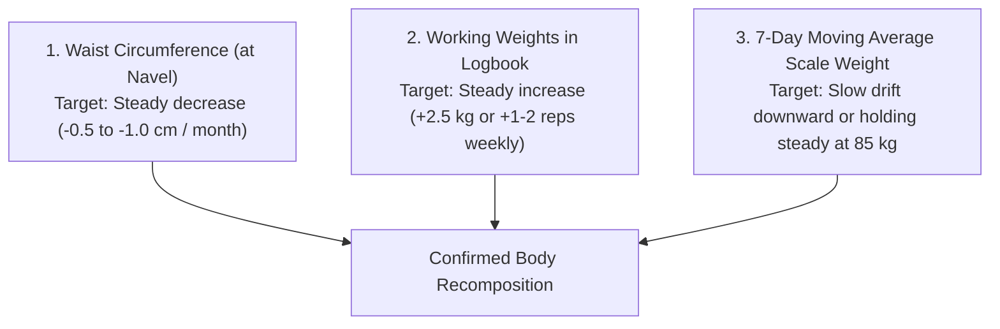

# Personal Command Center 📊

> **Your daily operational hub for tracking calories, macronutrients, training days, and body recomposition metrics.**

---

## 🎯 Daily Nutritional Targets (Calorie Cycling Model)

To optimize recovery on heavy lifting days while maximizing fat burning on recovery days, we apply a **calorie-cycling protocol**:

| Day Type | Daily Calories | Protein | Carbohydrates | Fats | Primary Purpose |
| :--- | :--- | :--- | :--- | :--- | :--- |
| **Training Days**  *(Mon, Tue, Thu, Fri)* | **2,250 kcal** | **180g** *(720 kcal)* | **220g** *(880 kcal)* | **70g** *(630 kcal)* | Fuel performance, glycogen replenishment, hypertrophy |
| **Rest Days**  *(Wed, Sat, Sun)* | **1,950 kcal** | **180g** *(720 kcal)* | **150g** *(600 kcal)* | **65g** *(585 kcal)* | Maximize lipolysis (fat loss), insulin sensitivity |

> [!IMPORTANT]
> **The 180g Protein Constant:** Notice that protein remains **strictly constant at 180g** every single day. Muscle protein synthesis lasts 24–48 hours after a workout—your muscles rebuild on rest days just as much as on training days!

---

## 📅 Weekly Training Schedule (4-Day Upper/Lower)

| Day | Session Type | Focus Muscles | Key Compound Lifts | Daily Steps |
| :--- | :--- | :--- | :--- | :--- |
| **Monday** | **Upper Body A** | Chest, Back, Shoulders, Arms | Flat DB Bench Press, Barbell Bent-Over Row | 8,000 – 10,000 |
| **Tuesday** | **Lower Body A** | Quads, Hamstrings, Calves, Core | Barbell Back/Goblet Squat, Romanian Deadlift | 8,000 – 10,000 |
| **Wednesday** | **Active Recovery** | Full Body Mobility & NEAT | 45-min brisk outdoor walk, foam rolling | 10,000+ |
| **Thursday** | **Upper Body B** | Upper Back, Shoulders, Triceps, Biceps | Lat Pulldown, Incline DB Press, Overhead Press | 8,000 – 10,000 |
| **Friday** | **Lower Body B** | Hamstrings, Glutes, Quads, Core | Leg Press, Lying Leg Curls, Bulgarian Split Squat | 8,000 – 10,000 |
| **Saturday** | **Active Recovery** | Light cardio, recreation | Long walk, recreational sports, mobility | 10,000+ |
| **Sunday** | **Rest & Meal Prep** | Nervous System Reset & Kitchen Logistics | 90-minute grocery shopping and meal prep | 7,000 – 8,000 |

---

## 📋 The 5-Point Daily Recomp Checklist

Every morning and evening, audit yourself against these 5 non-negotiable standards:

- [ ] **1. Protein Target:** Did you hit 175g–185g across 3–4 meals?
- [ ] **2. Caloric Target:** Did you stay within ±75 kcal of your target (2,250 on training days / 1,950 on rest days)?
- [ ] **3. Step Goal:** Did you reach 8,000 to 10,000 steps?
- [ ] **4. Hydration:** Did you drink at least 3.5 Litres of water?
- [ ] **5. Sleep Hygiene:** Are you getting 7.5 to 8.5 hours of uninterrupted sleep in a cool, dark room?

---

## 📈 The 3-Metric Recomp Progress Tracker

Do not rely solely on the bathroom scale. As a novice, you will build 1–2 kg of dense contractile muscle while shedding 1–2 kg of body fat, causing scale weight to remain deceptively constant.

Track these three metrics weekly:

| Date | 7-Day Avg Weight (kg) | Navel Circumference (cm) | Key Lift: DB Bench (kg x reps) | Key Lift: Squat (kg x reps) | Notes / Photos |
| :--- | :--- | :--- | :--- | :--- | :--- |
| **Week 1** | 85.0 kg | ______ cm | ______ kg x ______ | ______ kg x ______ | Baseline set |
| **Week 2** | ______ kg | ______ cm | ______ kg x ______ | ______ kg x ______ | |
| **Week 3** | ______ kg | ______ cm | ______ kg x ______ | ______ kg x ______ | |
| **Week 4** | ______ kg | ______ cm | ______ kg x ______ | ______ kg x ______ | Monthly audit |
