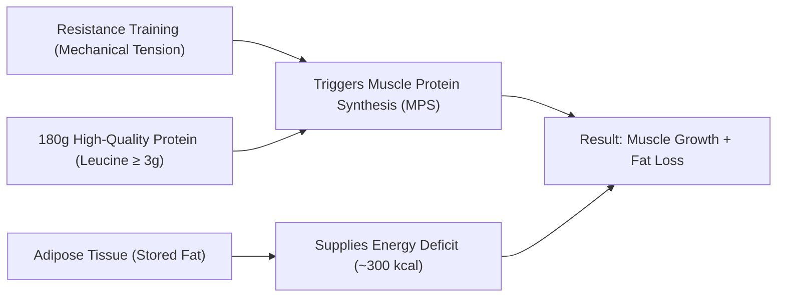

# The Body Recomposition Blueprint 🎯

> **Welcome to your personalized, science-based operating manual for building muscle and losing fat simultaneously.**

Body recomposition is the process of altering your adipose-to-muscle ratio: decreasing fat mass while synthesizing new contractile muscle tissue. Contrary to traditional bodybuilding dogma that demands aggressive "bulking" followed by agonizing "cutting," modern exercise physiology proves that simultaneous muscle growth and fat loss can be achieved with surgical precision—especially when training status, energy intake, and macronutrient timing are aligned.

---

## 📋 Athlete Baseline Profile

  

    
Height & Weight

    
184 cm / 85 kg

    
BMI: ~25.1 | Primed for Recomp

  

  

    
Daily Protein Target

    
180g

    
~2.1 g/kg | 4 x 45g Feedings

  

  

    
Training Protocol

    
4 Days / Wk

    
Upper / Lower Hypertrophy Split

  

  

    
Dietary Framework

    
Omnivore

    
High Bioavailability Complete Proteins

  

---

## ⚡ Why This Plan Works For You Right Now

Because you are **just starting out with structured resistance training** at **184 cm and 85 kg**, you possess two distinct physiological advantages:

1. **The "Novice Window" (Maximum Hypertrophic Sensitivity):**
   Untrained muscles experience an extraordinary spike in Muscle Protein Synthesis (MPS) following resistance training. Your body’s satellite cells (which donate nuclei to muscle fibers) respond rapidly to progressive mechanical tension, allowing muscle tissue to grow even while in a mild caloric deficit.

2. **Abundant Endogenous Energy Stores:**
   At 85 kg and 184 cm, your body possesses tens of thousands of calories stored in adipose tissue. By maintaining a high-protein intake (180g) and creating a moderate energy deficit (~300 kcal), your metabolism draws on stored adipose fatty acids to cover the caloric deficit and fuel the energy-intensive process of muscular hypertrophy.

---

## 🗺️ How to Use This Handbook

This blueprint is structured into 5 cohesive modules designed to take you from fundamentals to daily execution:

* **[The Command Center](dashboard.md):** Your central dashboard for macro targets, training calendar, and measurement trackers.
* **[Module 1 - Science & Physiology](chapter02-science.md):** The biological mechanisms of recomposition, the energy flux model, and research citations.
* **[Module 2 - Nutrition Architecture](chapter03-nutrition.md):** Exact caloric math, the 180g protein rule, grocery lists, 90-minute Sunday meal prep, and office nutrition.
* **[Module 3 - Training Architecture](chapter10-workout.md):** The complete 4-day Upper/Lower split, progressive overload mechanics, and exercise library.
* **[Module 4 - Recovery & Supplements](chapter12-recovery.md):** Sleep architecture, stress mitigation, and the 5 evidence-based supplements.
* **[Module 5 - Auditing & Maintenance](chapter17-scorecard.md):** The 3-Metric Rule and weekly audit scorecard to ensure continuous progress.

---

> [!TIP]
> **Start with the Command Center:** Bookmark [`dashboard.md`](dashboard.md) on your phone or browser. It contains your quick-reference daily numbers and workout schedule.
